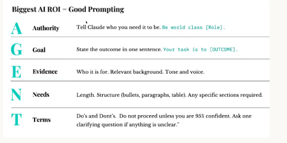
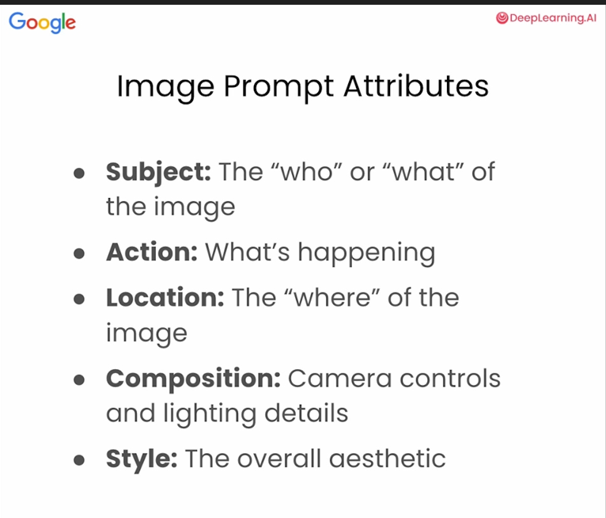

Title Slide
  1. Entrepenurship
1. Introduction
	1. Name
	2. School
	3. Hobbies 
	4. If you could start a business and money did not matter, what business would you start
2. Why start a business
	1. Serve others
	2. Pain points
	3. Freedom
	4. Purpose of a business- serving others well 
	5. Wow Moments- Bali, CLT
3. What do you need to start a business
  1. Website
  2. Tell friends and family
  3. Marketing
  4. Business Cards
4. Expectations
	1. Go slow and learn
	2. Open to all ideas
	3. Document all your work
	4. You are interning for Studio Kairos
	5. I want to give you work that you are interested in
	6. Learn different career fields
	7. I want this to be a conversation rather than a lecture. We will have a lot of hands on activities
	8. Write good notes
	9. We will have a break every hour for 7 minutes
	10. The last day, you will create your own business. Build your business plan and build out a website.
	11. At the end, I will talk one on one if you are interested in interning after this. Be honest
5. Enneagram Notes
   1. An overview of all the numbers. Give example of real life people also. This can span across 9 powerpoint slides.
6. [Enneagram Test with Wings 2026 | 100% Free & Instant Results](https://enneagram-personality.com/)
	1. 20 minutes
7. Vision and CLT
	1. What you do and what you really do
8. Business Plan
	1. Description of business
	2. vision of business
	3. Target Audience (demographics, pain points)
	4. Competitive Analysis- who are your competitors
	5. What makes you different or better than your competitors
	6. What is your marketing plan- flyers, SEO, social media, email, phone calls, local network
	7. Pricing Strategy- budget or premium provider
	8. Financial Projections
		1. Startup cost
		2. Break even analysis
		3. Projections
9. What is the hardest part of business
10. Marketing
	1. Pain points
	2. User Personas 
	3. Tone
	4. Practice together finding pain points and personas of CLT
		1. 15 minutes
	5. Show example
11. Marketing Principles
	1. Understand the business 
	2. Create content that targets someone pain point
	3. Create tone and brand aesthetics
	4. Target specific people and not everyone
12. Design Principles
	1. Readability
	2. Color Contrast
	3. Spacing
	4. Visual Hierarchy 
13. What is AI?
  1. Definition
  2. Use Cases
  3. Generative AI
    1. Create text, images, audio
14. Prompt Engineering with text
  1. Garbage In, Garbage Out
  
15. Practice Prompt Engineering with Agent framework 
  1. Start with generating text first- give students 5 minutes
    1. Create a prompt to find user personas for Clear Lake Tutor.
16. Prompt Engineering with Images Framework

17. Image Generation Capabilities

18. Image Generation Practice
 1. Pick a user persona and generate an image that speaks to the user's painpoint.
 2. Create an image- 10 minute
19. AI Models
  1. ChatGPT- 
    1. Pros- cheerleader, most user friendly, understands you very well, very positive, emoji, best at formatting information, ask good follow up questions,
    2. Cons- wont tell you the truth and always very positive, alot of emoji, writing style sounds to much like AI at times, 
  2. Gemini
    1. Pros- Most honest, will tell you bad news, Notebook LM for notes, good with google products, images, deep research, legal, cheapest, largest context window
    2. Cons- can be moody, not the best at coding, bland formatting, shorter responses
  3. Claude
    1. Pros- best a coding, best at writing, can create read, modify, and create files on your computer, creates great notes, 
    2. Cons- costly, not great at images
20. Agents
  1. definition- AI that can create actions such as making new files, coding, create images and do deep planning.
  2. examples
21. Token
  1. definition
  2. examples
  3. pricing of different models
22. Context Window
  1. definition
  2. examples
  3. ways to decrease context windows
  4. starting new chats to decrease context window
23. Claude Projects, Gemini Gems, Custom GPT
  1. Definition
  2. Use cases
24. Deep Research
  1. Definition
  2. Use Cases
25. Keyboard shortcuts
  1. copy- ctrl + c
  2. paste- ctrl + v
  3. screenshot- window + shift + s
26. Private Chat
  1. definition
  2. Don't want it to disrupt my AI memory and context
27. Talking to a client
	1. Describe your business to me
	2. Ask questions to get to know more about their company
	3. What are some wins that you have in your business 
	4. It sounds like you got your whole business figured out
	5. Goal to find their pain points
	6. How painful is this painpoint 
	7. Find out how much they are willing to pay to fix the pain or how much this pain is costing them
	8. Ask for a future meeting if time is limited
28. Emma- Research the business and person
	1.  I am going to do marketing for this website. Can you tell me everything about this website that includes descriptions, values, events, tone, other relevant information and services? The owner of this website is Mason Tang. Can you also provide me information on him? He lives in Houston, Texas. I want to know as much information as possible so that I can talk to the client more easily.
	2. Think about ideas to post on social media which includes LinkedIn, Facebook and maybe Instagram.
	3. Think about videos to post on youtube
	4. I want my content to be educational based
29. Lauren will find chemistry content
	1. Notes
	2. Worksheets
	3. Diagrams
	4. Tests
	5. Create Cheat Sheets using Claude Code
30. Abdullah will build out web pages for Clear Lake Tutor
	1. Walk through VS Code
  2. Take Study Guides and put them on CLT website. 
	3. [Responsive Web Design Certification | freeCodeCamp.org](https://www.freecodecamp.org/learn/responsive-web-design-v9)
31. Roshan
	1. Work on youtube videos
	2. Title — Up to 100 characters; front-load keywords; make it compelling
  3. Description — Up to 5,000 characters; include keywords, links, timestamps, and a call to action
  4. Thumbnail — Custom thumbnails are strongly recommended (1280×720 px, under 2MB, JPG/PNG/GIF); the auto-generated ones rarely perform as well
  5. Category — Pick the closest match (Education, Gaming, Entertainment, etc.)
  6. Tags — Up to ~500 characters worth; include your main keyword, variations, and related terms
  7. Research good practice problems to put on the video. Make sure the problems have variations to explain different concepts. 
  8. Video Script
  9. Research and watch youtube video to see which are the top performing.

