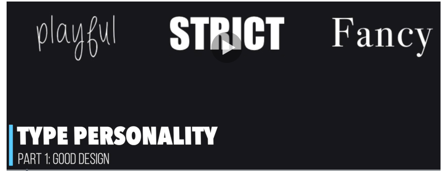
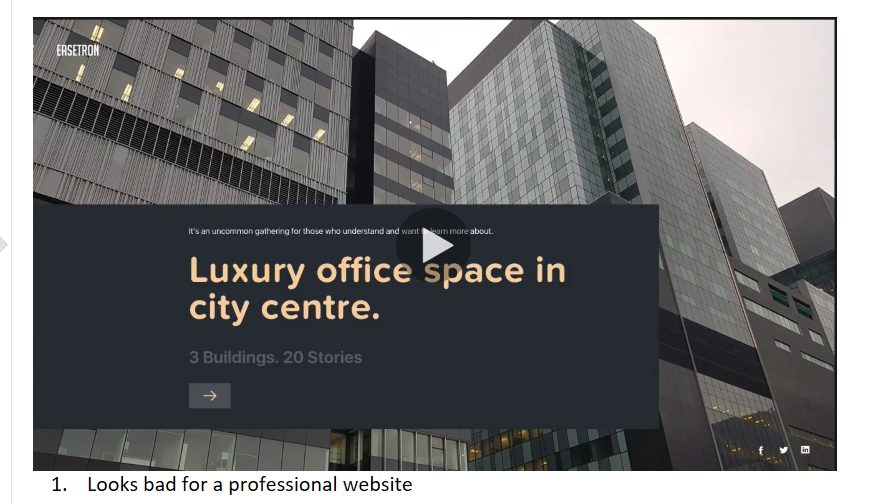
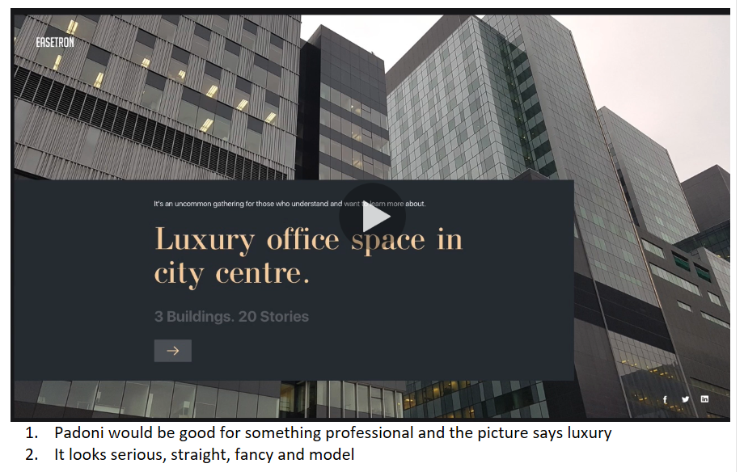
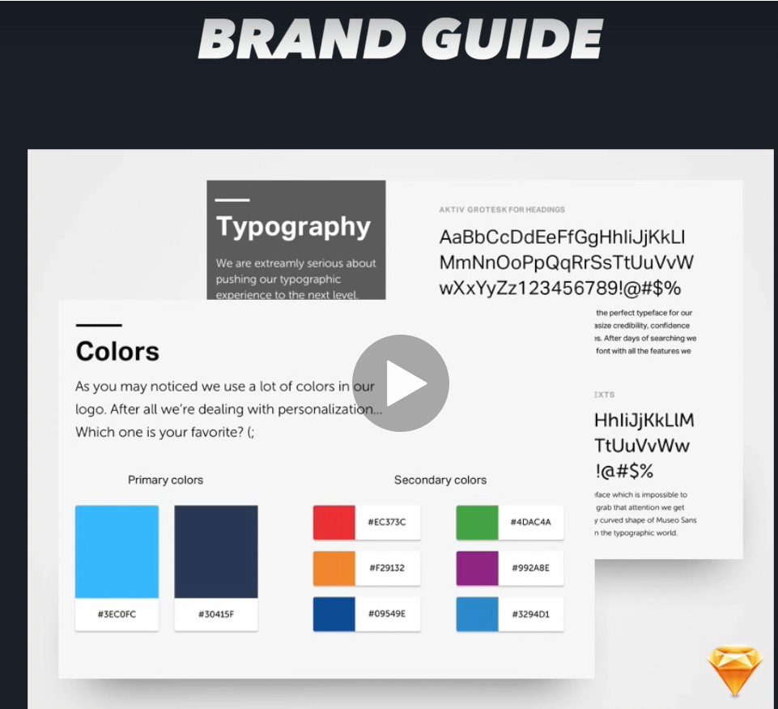
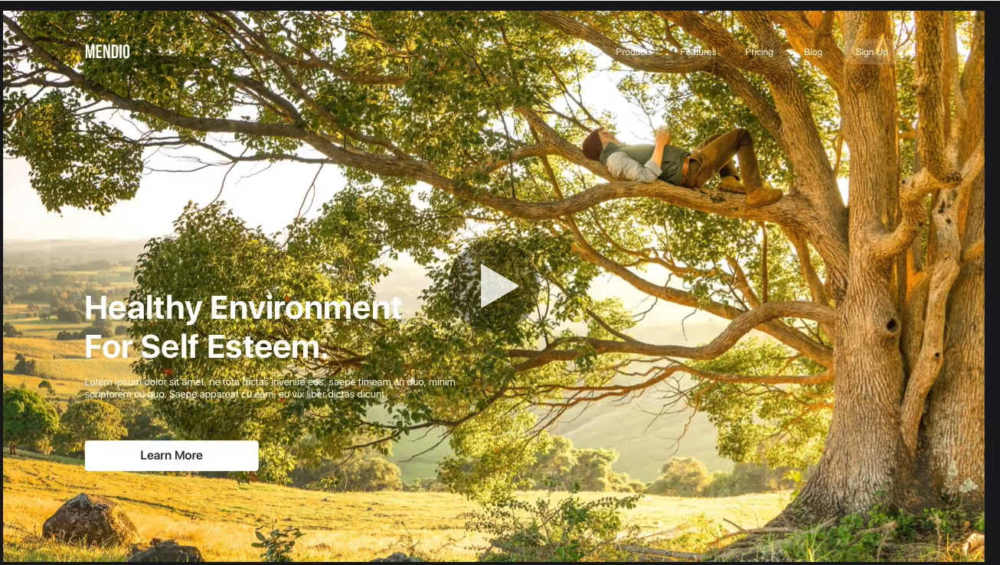
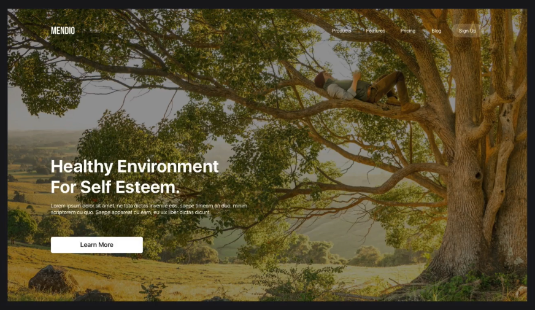

Title Slide: Working Genius and Design
1. Working Genius
	1. [6 Types Of Working Genius: Discover Your Gifts & Transform Your Work](https://www.workinggenius.com/)
  2. Create powerpoint slides for the 6 types with definitions and examples
2. What is good UI/UX design
  1. Good design is when you don't notice it
  2. Definition of good UI/UX design on a website
3. Visual Hiearchy- definition
4. Example of good visual hiearchy website with photo
5. Example of bad visual hiearchy website with photo
6. It all starts with alignment & Grid
   1. Definition
   2. Pictures of good alignment of a website
   3. Picture of bad alignment of a website
7. Color Theory
  1. What is color theory for a website
  2. Give examples of how different colors can change the tone of the website
8. Proximity
  1. Elements that are related should be close to one another.
  2. 
9. Typography all has a personality
  1. 
10. Bad Typography website

11. Good Typography website

12. Brand Guidelines
  1. Definitions
  2. Brand Guideline attributes
13. Brand Guidelines Examples

14. Netflix Logo Brand Guideline
15. Image overlay
  1. 
  2. 
16. Compare Websites
  1. https://www.coachsalinasmathtutor.com/
  2. https://www.clearlaketutor.com/

