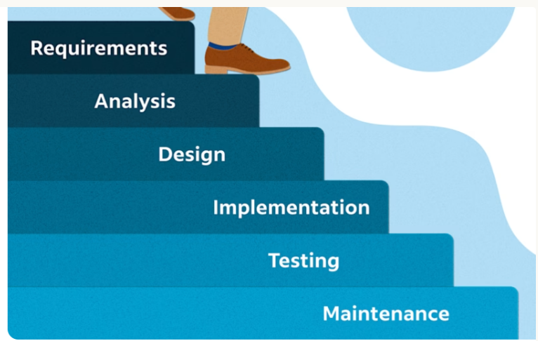

1. Compass personality test
	1. [personalitycompassandtests.pdf](https://www.leadrighttoday.com/uploads/9/4/1/6/9416169/personalitycompassandtests.pdf)
2. What makes a great Leader
	1. Servant Leadership- someone who prioritizes the growth, well-being, and success of their team above their own personal ambitions
	2. Empathy and Listening
	3. Persuasion over Coercion
	4. Protect your team
	5. Honesty
	6. Skill Development
	7. Integrity and Trustworthiness
	8. Elevate Others
	9. Delegate work
	10. Vision and Decisiveness
	11. Example
3. Project Management 
	1. Definition- discipline of planning, executing, and overseeing tasks to achieve specific business goals within a defined scope, timeline, and budget.
4. KPI
	1. Definition
	2. Examples
5. 5 Project Lifecycle Phases 
	1. **Initiation:** Defining the project's purpose, securing stakeholder buy-in, and establishing a business case.
	2. **Planning:** Outlining the roadmap, budget, and scope. This is where deliverables and resource requirements are finalized.
	3. **Execution:** Assigning tasks, building the deliverables, and ensuring the team stays on track
	4. **Monitoring & Controlling:** Tracking performance using KPIs to ensure the project stays within its time and cost constraints.
	5. **Closing:** Finalizing deliverables, evaluating the project's success, and releasing resources.
6. Waterfall Project Management
	1. PM methodology in which every tasks is laid out ahead of time which can span months
	2. 
7. Sprint Project Management
	1. ==an Agile framework where teams divide large, complex projects into short, focused development cycles called "sprints."== Usually lasting 1 to 4 weeks, sprints allow teams to adapt to changes quickly, test ideas, and deliver usable results iteratively rather than waiting until the end of a long timeline.
	2. The average sprint is two weeks
8. Key Terminology
	1. **Product Backlog:** A master, prioritized list of all features, requirements, and fixes for the project.
	2. **Sprint Backlog:** The specific subset of tasks the team commits to finishing during a single sprint.
	3. **Velocity:** A metric measuring how much work (typically estimated in "story points") a team successfully completes in a single sprint.
	4. **Scrum Master:** The facilitator who ensures the team adheres to Agile/Scrum practices, removes obstacles, and resolves blockers
9. Sprint Cycle
	1. Sprint Planning: The team and product owner determine the goal of the sprint and pull specific, high-priority tasks (e.g., user stories) from the product backlog.
	2. Execution: The development team works on the selected tasks for the duration of the sprint
	3. **Daily Standup:** A brief, 15-minute daily meeting where team members align on what they accomplished, what they will do next, and any blockers.
	4. Sprint Review- A demonstration of the completed work to stakeholders to gather feedback and adjust the backlog if needed
	5. Retrospective: The team meets to reflect on the sprint process itself—discussing what went well and what can be improved for the next cycle
10. PRD- Project Requirement Document
	1. A ==**Product Requirements Document (PRD)**== is a foundational guide that outlines a product’s purpose, features, functionality, and behavior. Created before development begins, it acts as a single source of truth to align designers, engineers, and stakeholders on _what_ is being built and _why_
11. Key Components of PRD
	1. **Product Overview:** The purpose, main value propositions, and core use cases.
	2. **Target Audience:** User personas and specific user stories.
	3. **Features & Functionality:** Detailed descriptions of what the product will do.
	4. **Success Metrics:** Specific, measurable KPIs that define a successful release.
	5. **Assumptions & Risks:** Dependencies, technical constraints, or potential blockers. 
12. SOP (Standard Operating Procedure) is ==a set of step-by-step instructions compiled by an organization to help workers carry out routine operations==. Its primary goal is to achieve efficiency, quality output, and uniformity of performance while reducing miscommunication and human error.
13. Components to SOP
	1. **Purpose & Objective:** A brief summary of why the SOP exists and what it accomplishes.
	2. **Scope:** Who the document applies to and in what situations it should be used.
	3. **Responsibilities:** A defined list of exactly who is responsible for carrying out the steps.
	4. **Step-by-Step Instructions:** Detailed, sequential actions required to complete the task.
	5. **Definitions & References:** Glossary of terms, acronyms, and links to relevant regulations or manuals.
14. Trello
	1. Show the khanban board and explain
15. Henry presentation
